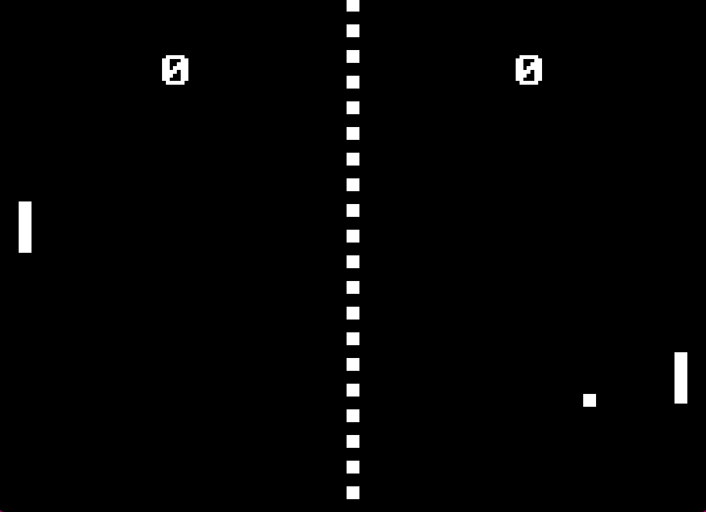

<h1 align="center">Pong in SDL C++</h1>

## What is this project?
- This fun project was used to sharpen my C++, SDL and GitHub skills. It may not be the best code, it may have some issues, but it doesn't matter.
- I learned a lot, including Object Oriented Programming and code readability.

## Features
- It works
- You can move using the keyboard.
- You can't win or lose.
- It may have bugs (it's a feature).
- You don't need friends to play!
- Windows compatible :)

## Showcase


## Downsides
- You probably wasted time reading all of this
- Was not tested on Linux yet

## Building from source
1. Make sure you have SDL2 and GCC compiler installed on your machine.

2. Clone the repository

3. Open terminal of your choice in the folder and type

```
make all
```

4. Wait for compilation, then you can open the executable

- You can't compile if the .exe file is already opened
- The exe has to stay in the folder
